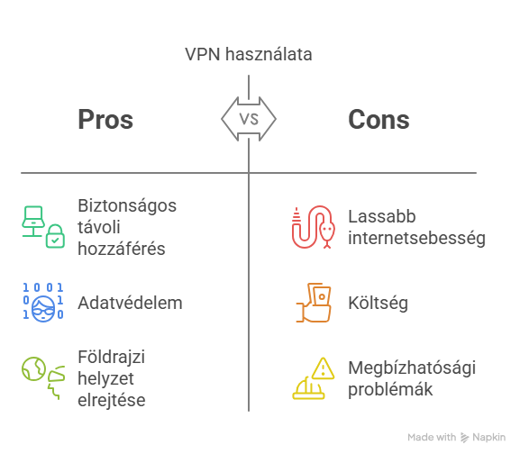
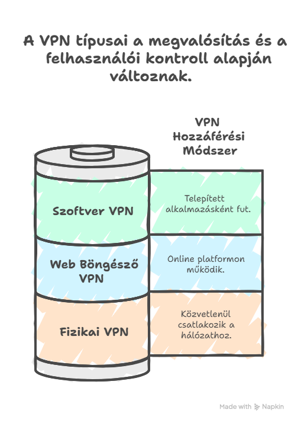
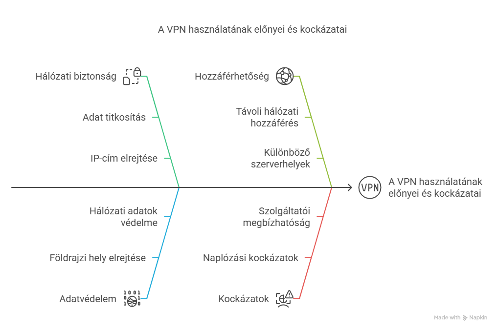

## VPN Bemutatása

A VPN (virtuális privát hálózat) egy olyan távoli kapcsolat kialakítását jelenti, melynek segítségével egy távoli számítógép egy privát hálózatra tud csatlakozni akár távolról is. 
Vállalati környezetben rendszerint a vállalati hálózathoz történő csatlakozás egyik módszere a VPN használata. Emellett azonban léteznek olyan VPN szolgáltatások is, melyek különböző földrajzi helyeken elhelyezett kiszolgálókhoz engednek csatlakozni, ezzel elrejtve a felhasználó valós földrajzi helyzetét, valamint hálózati kapcsolódási adatait.

Az online adatgyűjtés során azért célszerű VPN-t használni, hogy az eredeti – szolgáltató által biztosított IP-címet (ezáltal a szolgáltató kilétét, a hozzávetőleges földrajzi helyzetünket), valamint egyéb hálózati kapcsolódási adatainkat elrejtsük. Ha ezt nem tesszük meg, akkor egy webhely üzemeltetője a kapcsolódási napló fájlokból könnyedén megállapíthatja, hogy milyen hálózati adatokkal kerestük fel az általa üzemeltetett weboldalt.

A kapcsolat elfedésére használt VPN-nek alapvetően három típusát különböztethetjük meg:
- a fizikai,
- a web-böngésző alapú
- a szoftveres VPN-klienst.

A fizikai VPN-kliens egy hardveres eszköz, amelyet a hálózati infrastruktúrához csatlakoztatnak, a web-böngésző alapú VPN-kliens egy online platformon keresztül működik, és a szoftveres VPN-kliens egy telepített alkalmazás, amely a felhasználó számítógépén vagy mobil eszközén fut. A választott VPN-kliens típusa függ az adott alkalmazás, igények és preferenciák specifikációjától és követelményeitől.

A fizikai kliens esetében egy fizikai számítógépet használunk „átjátszóként”: ez lehet egy külön erre a célra telepített PC, vagy egy virtuális kiszolgáló is, amelyhez csatlakozva ennek az eszköznek az internetkapcsolatát használjuk a világháló irányába. Ilyen eszköz lehet akár egy mikroszámítógép is, például az alább látható Raspberry Pi, amely egy teljes funkcionalitással rendelkező számítógép.

A web-böngésző alapú VPN esetében egy böngésző-kiegészítőt kell telepíteni, amely bekapcsolást követően átirányítja a böngészőben keletkezett hálózati kapcsolatot a szolgáltató által biztosított szervereken keresztül. Fontos azonban, hogy az ilyen VPN kizárólag a böngészők által generált forgalmat irányítja át, így nem minden esetben biztosít teljes anonimitást.

**1. Titkosítás:** Amikor csatlakozik egy VPN-hez, az összes adatát titkosítják. Ez azt jelenti, hogy az internetes tevékenységét nem lehet könnyen megfigyelni vagy lehallgatni.
**2. IP cím változtatása:** A VPN egy másik IP-címet biztosít, amely eltérhet a valós IP-címétől. Ez általában a VPN szerverének IP-címe.
**3. Túljutás földrajzi korlátozásokon:** A VPN segítségével elérheti azokat az internetes tartalmakat és szolgáltatásokat, amelyekre földrajzi korlátozások vonatkoznak, mivel a VPN szervereinek elhelyezkedése lehetővé teszi a tartalomhoz való hozzáférést.
**4. Magán- és biztonság:** A VPN által biztosított titkosításnak és IP-cím védelmének köszönhetően a felhasználók internetes tevékenységét nehéz követni, ezáltal növelve a magánszférát és a biztonságot.
**5. Csatlakozás a VPN szerverhez:** Amikor csatlakozik egy VPN szerverhez, a készülékének létre kell hoznia egy biztonságos kapcsolatot a szerverrel. Ez a kapcsolat általában egy kriptografikus protokollon, például az OpenVPN-en, L2TP/IPsec-en vagy PPTP-n keresztül valósul meg.
**6. Internetes forgalom irányítása:** Miután csatlakozott a VPN-hez, az összes internetes forgalom áthalad a VPN szerveren, mielőtt eljutna az internetre. Ez azt jelenti, hogy a szerver általában az útvonal a felhasználó és az internet között, így a külső szemlélők nem tudják meghatározni a felhasználó pontos földrajzi helyzetét vagy azonosítani őt a valódi IP-címe alapján.
**7. VPN kliens használata:** A legtöbb VPN szolgáltatás kliens alkalmazást is biztosít a felhasználók számára, amely egyszerűsíti a VPN-hez való csatlakozást és az összes szükséges beállítást.

